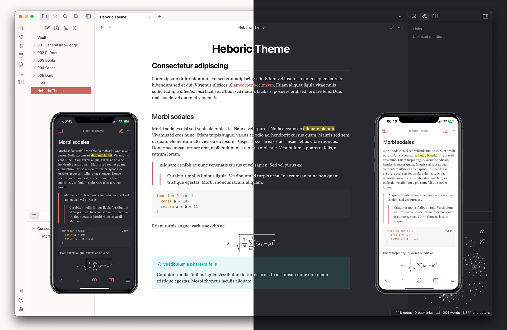

# Heboric Obsidian Theme

A clean, elegant theme for [Obsidian](https://obsidian.md/), built with a pleasant reading experience in mind.

## Features

- Built for comfortable reading
- Dark and light themes
- Easier-to-read mathematics

## Installation

1. Download the code / clone this repo into your themes folder ( `[YourVault]/.obsidian/themes` )
2. Change your theme to Heboric in Obsidian Settings > Appearance (may require a reload of Obsidian).
